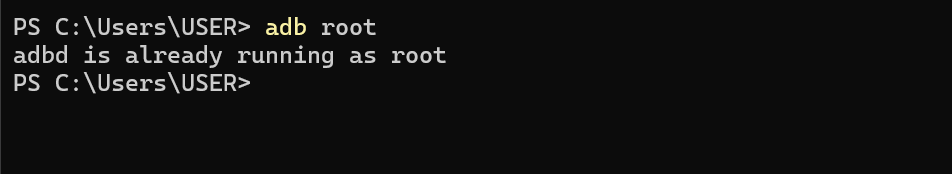
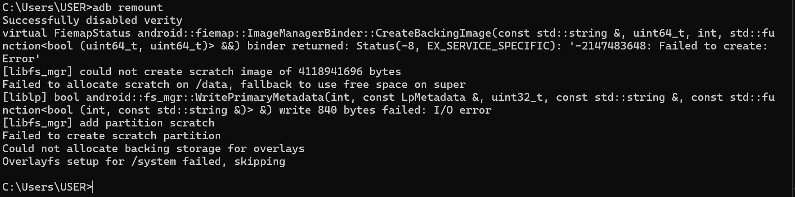
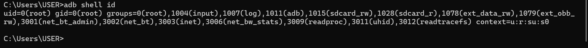
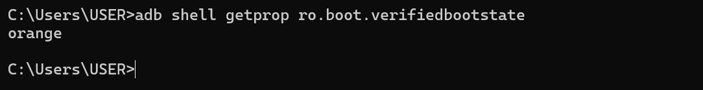

# LAB 2  Rooting Android

 Cours  Sécurité des applications mobiles
---

## Objectif du lab

Dans ce lab, je vais rooter un environnement Android (AVD) afin de comprendre l'impact du root sur la sécurité du système.

---

## Étape 1  Rooter l'AVD

J'active le mode root s

```bash
adb root
```

Vérification 



---

Je remonte la partition système en lectureécriture 

```bash
adb remount
```

Vérification 



---

## Étape 2  Vérification du root

Je vérifie mes privilèges 

```bash
adb shell id
```

Vérification 



---

Je vérifie l'état du système 

```bash
adb shell getprop ro.boot.verifiedbootstate
```

Vérification 



---

Je teste la commande `su` 

```bash
adb shell su -c id
```

Vérification 


---

## Étape 3  Vérifier l'AVD

```bash
adb devices
```

* Vérification 


---

## Étape 4  Installer l'application

```bash
adb install app-debug.apk
```

Vérification 


--- 
## Étape 5 Désactiver Verity 

```bash
adb disable-verity
adb reboot
adb remount
```

Vérification 


---

## Étape 6  Journalisation

```bash
adb logcat -d  tail -n 200  logcat_root_check.txt
```

Vérification 


---

## Étape 7  Traçabilité

Je vérifie que l'application fonctionne correctement 

Vérification 


---

Je confirme que le root est actif 

Vérification 


---


## Conclusion

Dans ce lab, j'ai appris que le root donne un contrôle total sur Android mais compromet la sécurité du système. Il doit être utilisé uniquement dans un environnement de test isolé.


--- 