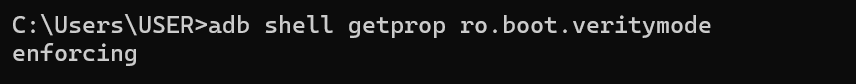
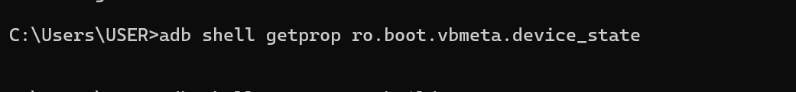
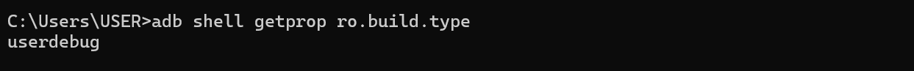
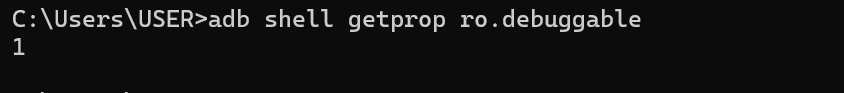

# LAB 2  Rooting Android

 Cours  Sécurité des applications mobiles
---

## Objectif du lab

Dans ce lab, je vais rooter un environnement Android (AVD) afin de comprendre l'impact du root sur la sécurité du système.

---

## Étape 1  Rooter l'AVD

J'active le mode root s

```bash
adb root
```

Vérification 


---

Je remonte la partition système en lectureécriture 

```bash
adb remount
```

Vérification 


---

## Étape 2  Vérification du root

Je vérifie mes privilèges 

```bash
adb shell id
```

Vérification 


---
## Étape 3 — Vérifications de l'état du système

### État du Verified Boot

```bash
adb shell getprop ro.boot.verifiedbootstate
```

Résultat obtenu : `orange`

L'état `orange` confirme que le bootloader est déverrouillé et que la vérification d'intégrité du système est désactivée. Sur un appareil de production, cette valeur serait `green`.

Vérification :


---

### État de Verity

```bash
adb shell getprop ro.boot.veritymode
```

Résultat obtenu : `enforcing`

Verity est encore marqué `enforcing` au niveau de la propriété système, mais il a bien été désactivé par `adb remount` (confirmé par le message `Successfully disabled verity`). Ce décalage est normal sur Android 12+ — la propriété reflète la config initiale, pas l'état runtime.

Vérification :



---

### État du vbmeta

```bash
adb shell getprop ro.boot.vbmeta.device_state
```

Résultat obtenu : *(vide)*

La valeur vide indique que cette propriété n'est pas définie sur cet émulateur. C'est un comportement attendu sur certaines images AVD qui ne gèrent pas vbmeta de la même façon qu'un device physique.

Vérification :



---

### Type de build

```bash
adb shell getprop ro.build.type
```

Résultat obtenu : `userdebug`

Le build de type `userdebug` est indispensable pour activer le root via ADB. Un build `user` (production) bloquerait ces opérations.

Vérification :



---

### Débogage activé

```bash
adb shell getprop ro.debuggable
```

Résultat obtenu : `1`

La valeur `1` confirme que le mode debug est activé sur cette image, ce qui est cohérent avec le build `userdebug`.

Vérification :



---
### Test su (superutilisateur)

Je teste la commande `su` 

```bash
adb shell su -c id
```
Résultat obtenu : `su: invalid uid/gid '-c'`

La commande `su` est présente sur l'émulateur mais son implémentation ne supporte pas le flag `-c` de cette façon. Pour tester les privilèges root dans le shell, utiliser plutôt :

---


## Conclusion

Dans ce lab, j'ai appris que le root donne un contrôle total sur Android mais compromet la sécurité du système. Il doit être utilisé uniquement dans un environnement de test isolé.


--- 